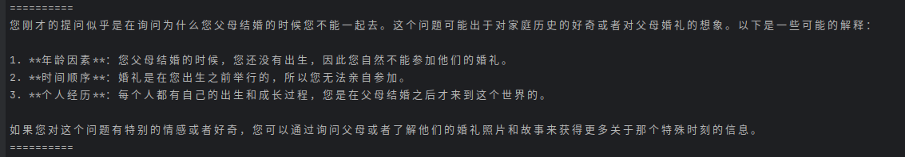
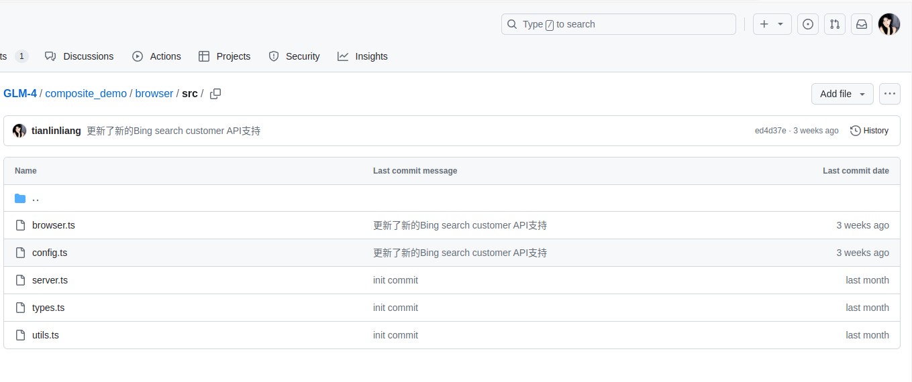
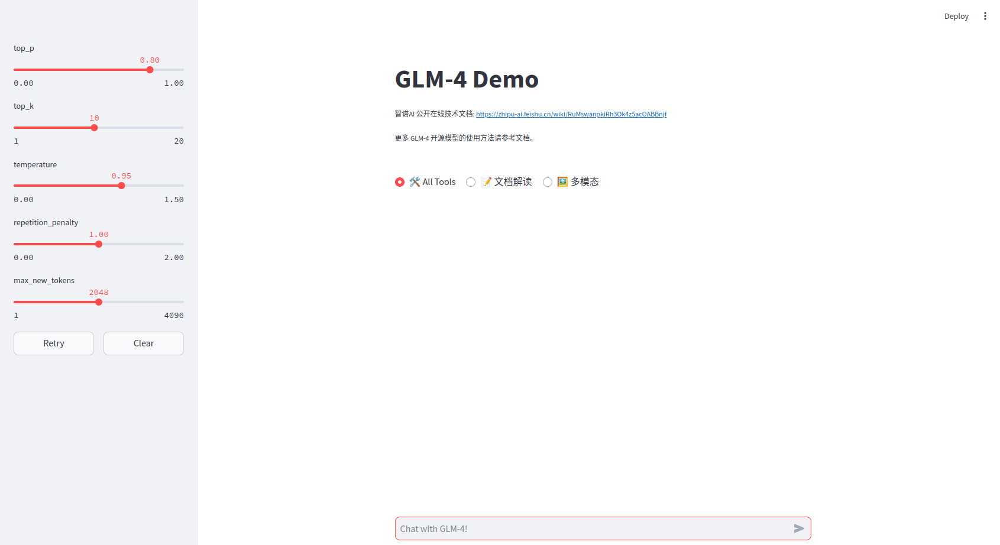
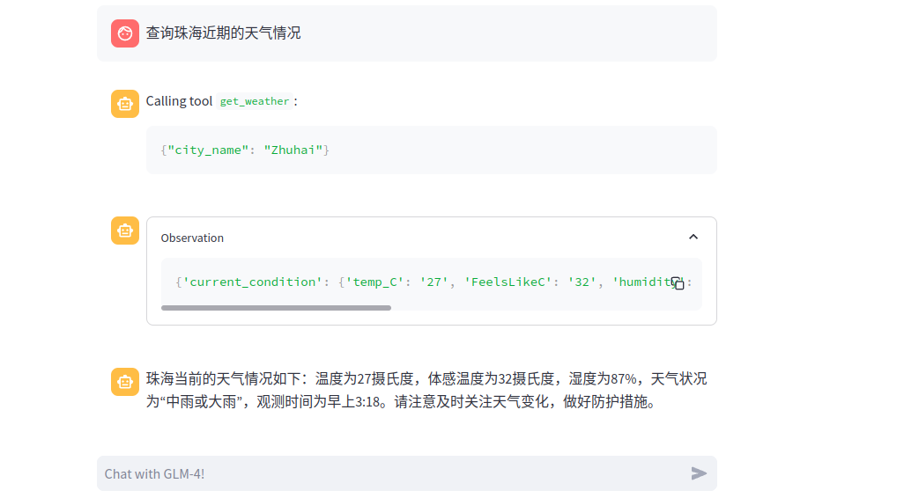

Read this in [Chinese](README_cn.md)
## Project name
  **Based on the GLM4 open source project to achieve vector database search enhanced generation (RAG)**

## Preamble to the project
Generative AI is now is one of the most exciting and widely promising technologies in the field of artificial intelligence. With applications in fields as diverse as art, entertainment, healthcare, and security, it is capable of creating new and original content such as images, text, music, or other media works. Through its unique creativity and innovation, generative AI is ushering in a world of new possibilities. Whether it's the booming LLM technology or Sora, the generative video macromodel, it shows the powerful popularity of today's generative applications in today's world. Developers need the power of GPUs to pre-train large-scale models or to deploy them.

The AMD ROCm™ open source AI development software platform provides a great working environment for AMD AI developers. The powerful ROCM open source computing platform supports building AI solutions on a wide range of AMD GPU hardware. ROCm integrates seamlessly with a variety of industry-standard frameworks, such as PyTorch and TensorFlow, and provides rich software libraries to power machine learning training and inference. ROCm also provides a rich set of tools and libraries such as MIOpen (acceleration library for deep learning), rocBLAS (high performance linear algebra library), and rocFFT (Fast Fourier Transform library) to help developers simplify the development process and improve performance.

In this category, our developers were able to utilize the ROCm software platform and AMD Radeon™ PRO W7900 ultra-high-performance graphics card to design a unique LLM application solution that enhances the information retrieval capabilities of LLM to solve real-world problems.


## Project Introduction

This project uses a high-performance professional graphics card AMD Radeon™ PRO W7900 for deployment and debugging. The powerful reasoning capability of AMD Radeon™ PRO W7900 and the massive 48GB video memory help our project developers to complete the deployment, testing, debugging and writing new LLM application solutions. The success of our project is due to the powerful inference capability of AMD Radeon™ PRO W7900 graphics card and the ROCM open source computing platform's seamless integration of multiple industry standard frameworks for today's mainstream deep learning.

Our project is based on the Github open source project THUDM/GLM-4 for development, testing and debugging.**GLM-4-9B** is the open source version of the latest generation of pre-trained models in the GLM-4 series introduced by Smart Spectrum AI. In multiple dataset measurements of semantics, math, reasoning, code, and knowledge, the**GLM-4-9B** and its human preference-aligned version **GLM-4-9B-Chat** have demonstrated superior performance over Llama-3-8B. In addition to being able to conduct multiple rounds of dialog, GLM-4-9B-Chat supports the advanced feature of long text inference (supporting up to 128K contexts). Multi-language support has been added to this generation of models, supporting 26 languages including Japanese, Korean, and German.26 languages.Original Open source projects Github address：https://github.com/THUDM/GLM-4/tree/main

**We successfully deployed the project by using AMD Radeon™ PRO W7900 graphics card and conducted a series of tests, after testing the project, we implemented the improvements to its Large Model Browser Networking Retrieval and submitted a PR to the repository and finally the project passed the code submitted by our working group. The project was further utilized by our working group to develop and implement the Retrieval Augmentation Generation (RAG) functionality for LLM's vector databases. Our work could not have been accomplished without the use of a high-performance professional graphics card, AMD Radeon™ PRO W7900, for deployment and debugging, as well as the robust ROCM open source computing platform for PyTorch and TensorFlow!**

**The GLM4 project is not using AMD's high-performance graphics cards for its official release of relevant inference test data, and its official release of test hardware information is as follows:**


+ OS: Ubuntu 22.04
+ Memory: 512GB
+ Python: 3.10.12 （recommend） / 3.12.3 tested
+ CUDA Version:  12.3
+ GPU Driver: 535.104.05
+ GPU: NVIDIA A100-SXM4-80GB * 8

The GLM4 project was not tested with AMD's high-performance graphics cards, including in conversations with the project developers and maintainers, and the project maintainers were surprised that AMD's high-performance graphics cards were able to run their project's LLMs without any problems, as they did not perform inference tests for AMD graphics cards.。


## Contributions to the open source community


Our working group deployed the model for this project and conducted a series of tests, in which we successfully discovered a small probability of an error in the GLM4 model, which usually occurs when the model is generating long textual content and causes the model to fail to continue generating text and throws the following error message：

```error
Exception in thread Thread-11 (generate):
Traceback (most recent call last):
  File "/home/liang/miniconda3/envs/pytorch/lib/python3.10/threading.py", line 1009, in _bootstrap_inner
    self.run()
  File "/home/liang/miniconda3/envs/pytorch/lib/python3.10/threading.py", line 946, in run
    self._target(*self._args, **kwargs)
  File "/home/liang/miniconda3/envs/pytorch/lib/python3.10/site-packages/torch/utils/_contextlib.py", line 116, in decorate_context
    return func(*args, **kwargs)
  File "/home/liang/miniconda3/envs/pytorch/lib/python3.10/site-packages/transformers/generation/utils.py", line 1914, in generate
    result = self._sample()
  File "/home/liang/miniconda3/envs/pytorch/lib/python3.10/site-packages/transformers/generation/utils.py", line 2693, in _sample
    next_tokens = torch.multinomial(probs, num_samples=1).squeeze(1)
RuntimeError: probability tensor contains either inf, nan or element < 0
```

Apparently the last error message points to a problem due to the torch.multinomial function processing the probability tensor and finding that it contains elements that are infinite (inf), non-numeric (nan), or less than zero. This usually indicates numerical instability or input data anomalies in the model generation process. **So we immediately reported it to the developers as well as the maintainers of the GLM4 project. After reporting the issue, the developers recognized the problem reported by our tests and have started working on fixing it.**


## Project equipment and environment
+ OS: Ubuntu 22.04
+ Memory: 128GB
+ Python: 3.10.14 
+ ROCM Version:  rocm6.0
+ GPU Driver: 24.10.3
+ GPU:  AMD Radeon™ PRO W7900* 1

## Project invocation process
Pre-installation of torch, torchaudio version 2.3.1+rocm6.0 and torchaudio version 0.18.1+rocm6.0 is required.
A quick installation can be done with the following command.

pip install torch==2.3.1 torchvision==0.18.1 torchaudio==2.3.1 --index-url https://download.pytorch.org/whl/rocm6.0

Then go to the GLM4 project and install the dependent projects using the following commands (it is recommended to create a new virtual environment, the following commands are done in a virtual environment):

```shell
cd GLM-4
cd basic_demo
pip install -r requirements.txt
```

**After installing these dependencies it is possible to call the model for simple dialogs, which can be done with the GLM-4-9B model using the command line**

```shell
python trans_cli_demo.py # Calling GLM-4-9B-Chat to realize continuous conversation

```

At this point you can get a first taste of deploying a local LLM with a high-performance professional graphics card AMD Radeon™ PRO W7900 (at this point you are invoking a regular model for a Dolan dialog), and the example is asking what the model can do for us:


**Use Batch inference.**

```shell
python trans_batch_demo.py
```
The batch_message of the input model is:

```python
    batch_message = [
        [
            {"role": "user", "content": "我的爸爸和妈妈结婚为什么不能带我去"},
            {"role": "assistant", "content": "因为他们结婚时你还没有出生"},
            {"role": "user", "content": "我刚才的提问是"}
        ],
        [
            {"role": "user", "content": "你好"}
        ]
    ]
```
Output results:

We can also use GLM-4-9B-Chat for advanced features such as web browsing, code execution, and long text reasoning (up to 128K contexts).

To implement these features, we first need to configure some configuration files and install some additional dependencies (in the virtual environment of the previous installation):

```bash
cd composite_demo
pip install -r requirements.txt
```

Please note that this project requires Python 3.10 or higher.
In addition, the Jupyter kernel is required to use Code Interpreter:

```bash
ipython kernel install --name glm-4-demo --user
```


You can modify `~/.local/share/jupyter/kernels/glm-4-demo/kernel.json` to change the configuration of the Jupyter kernel, including kernel startup parameters. For example, if you want to use Matplotlib to draw diagrams when using All Tools' Python code execution capabilities, you can add `“--matplotlib=inline”` to the `argv` array.

To use the browser and search functions, you will also need to launch the browser backend. First, install Node.js according to the [Node.js](https://nodejs.org/en/download/package-manager)
The official website instructs you to install Node.js, and then install the package manager [PNPM](https://pnpm.io) before installing the dependencies for the browser service.
**It is worth noting that our development team implemented support for the new Bing search customer API in the browser search function, improving the experience of calling the browser tool for large models and making it easier to use.**

## Run
```bash
cd browser
npm install -g pnpm
pnpm install
```
## Configuration modifications and startup

1. Modify `BING_SEARCH_API_KEY` in `browser/src/config.ts` to configure the Bing Search API Key that the browser service needs to use:

    ```diff
    export default {

        BROWSER_TIMEOUT: 10000,
        BING_SEARCH_API_URL: 'https://api.bing.microsoft.com/v7.0',
        BING_SEARCH_API_KEY: '<PUT_YOUR_BING_SEARCH_KEY_HERE>',

        HOST: 'localhost',
        PORT: 3000,
    };
    ```
   If you are registered with the Bing Customer Search API, you can modify your profile as follows and fill in your Custom Configuration ID.

    ```diff
    export default {
        LOG_LEVEL: 'debug',
        BROWSER_TIMEOUT: 10000,
        BING_SEARCH_API_URL: 'https://api.bing.microsoft.com/v7.0/custom/',
        BING_SEARCH_API_KEY: 'YOUR_BING_SEARCH_API_KEY',
        CUSTOM_CONFIG_ID :  'YOUR_CUSTOM_CONFIG_ID', //将您的Custom Configuration ID放在此处
        HOST: 'localhost',
        PORT: 3000,
   };
    ```

2. The CogView API needs to be called for the text-to-graph function. modify `src/tools/config.py` to provide the [Wisdom Spectrum AI Open Platform]() API Key,to provide the API Key of [Wisdom Spectrum AI Open Platform](https://open.bigmodel.cn) which is required to use for the text-generated graph function:

    ```diff
    BROWSER_SERVER_URL = 'http://localhost:3000'
    
    IPYKERNEL = 'glm-4-demo'
    
    ZHIPU_AI_KEY = '<PUT_YOUR_ZHIPU_AI_KEY_HERE>'
    COGVIEW_MODEL = 'cogview-3'
    ```

3. Start the browser backend, in a separate shell:

    ```bash
    cd browser
    pnpm start
    ```

4. Run the following command in another terminal to load the model locally and start the demo:

    ```bash
    streamlit run src/main.py
    ```
If the configuration is correct, the command will automatically launch the default browser and open the dialog page (note that the All Tools option is checked)
At this point, it is possible to use the web port to conduct a Dolan dialog with a locally deployed LLM, using advanced features such as GLM-4-9B-Chat web browsing, code execution, and long text inference (up to 128K contexts).
  

**It is worth noting that our development team additionally implemented LLM's Vector Database Retrieval Augmented Generation (RAG) feature on this project, which improves the quality of the generated text: by introducing a retrieval mechanism, the model can obtain more relevant and accurate information during the generation process. At the same time, by retrieving real data and documents, LLM can reduce the phantom effect of the model and provide more reliable answers. Enhancing interpretability, we design the vector database to also implement vector text traceability, providing a reference source for the content of LLM responses**

The following is the creation of vector database code, its role is to quantize the text content and stored in the FAISS vector database, provided to the subsequent LLM to call the contents of the vector database for querying the call, it should be noted that the text file should be put into the example and the doc1 document and doc2 document consistent with the contents of a paragraph of text without blank lines.

```python 
#/Base GLM-4 Demo for Vector Database Search/composite_demo/src/tools/Create  vector database.py
import os
import json
from langchain_nvidia_ai_endpoints import NVIDIAEmbeddings
from langchain.vectorstores import FAISS
from langchain.text_splitter import CharacterTextSplitter

# Set NVIDIA API key
os.environ["NVIDIA_API_KEY"] = "put_your_nvidia_ai_api_here"

# Load embedding model
embedder = NVIDIAEmbeddings(model="ai-embed-qa-4")

# Use relative path; files should be the same as the example doc1 and doc2 documents, containing a block of text without blank lines.
base_path = os.path.dirname(os.path.dirname(os.path.abspath(__file__)))
file_paths = [
    os.path.join(base_path, "tools", "doc1.txt"),
    os.path.join(base_path, "tools", "doc2.txt")
]

# Initialize text splitter
text_splitter = CharacterTextSplitter(chunk_size=400, separator=" ")

# Initialize lists to store split texts and metadata
docs = []
metadatas = []

# Read file contents and perform splitting
for file_path in file_paths:
    with open(file_path, 'r', encoding='utf-8') as file:
        content = file.read()
        splits = text_splitter.split_text(content)
        docs.extend(splits)
        metadatas.extend([{"source": file_path}] * len(splits))

# Print split text blocks and metadata to check if the format is correct
for i, (doc, metadata) in enumerate(zip(docs, metadatas)):
    print(f"Text block {i+1}:\n{doc}\n")
    print(f"Metadata {i+1}:\n{metadata}\n")

# Create vector store
store = FAISS.from_texts(docs, embedder, metadatas=metadatas)
store.save_local('./nv_embedding')

# Load vector store and perform query
store = FAISS.load_local("./nv_embedding", embedder, allow_dangerous_deserialization=True)
retriever = store.as_retriever()

# Test if the vector database is successfully built; modify according to your text content
query = "data science"
results = retriever.get_relevant_documents(query)

# Manually extract the serializable parts from results
serializable_results = []
for result in results:
    serializable_results.append({
        'metadata': result.metadata,
        'page_content': result.page_content
    })

# Output query results to test if the vector database is successfully built
print(json.dumps(serializable_results, ensure_ascii=False, indent=2))


```
The following part of the code is to write the query function for the vector database in the tool class of the project and load the vector storage to be queried by the vector query tool.
```python
#/Base GLM-4 Demo for Vector Database Search/composite_demo/src/tools/tool_registry.py
from langchain_nvidia_ai_endpoints import NVIDIAEmbeddings
from langchain.vectorstores import FAISS
import os

# Set NVIDIA API key
os.environ["NVIDIA_API_KEY"] = "put_your_nvidia_ai_api_here"

# Define embedding model
embedder = NVIDIAEmbeddings(model="ai-embed-qa-4")

# Load vector store
base_path = os.path.dirname(os.path.dirname(os.path.abspath(__file__)))
filepaths = os.path.join(base_path, "tools", "nv_embedding")
print(filepaths)
store = FAISS.load_local(filepaths, embedder, allow_dangerous_deserialization=True)
retriever = store.as_retriever()

#......omitted part of tool_registry code

@register_tool
def vector_db_query(
        query: Annotated[str, "The query text to search in the vector database", True],
) -> str:
    """
    Queries the vector database using the given query text and returns the results in JSON format.
    """
    if not isinstance(query, str):
        raise TypeError("Query must be a string")

    # Perform query
    results = retriever.get_relevant_documents(query)

    # Manually extract the serializable parts from results
    serializable_results = []
    for result in results:
        serializable_results.append({
            'metadata': result.metadata,
            'page_content': result.page_content
        })

    # Return query results
    return json.dumps(serializable_results, ensure_ascii=False, indent=2)


```
After running the vector database generation code, we can ask it about the information we have stored in the vector database, and the LLM will use the information in the vector database to retrieve and integrate the information into a response. The RAG enhances the interpretability of the model and the accuracy of the responses, while reducing the likelihood of model hallucinations.
  

We can then go on to ask what document it's reply came from, making it text-traceable
  
A networking tool can be invoked to ask the model for recent news information and summarize it, and a link can be clicked to view the details of the news.

  

Perform the implementation of the weather query function:

 

An image description can be entered in the input box to allow the model to invoke the Vincennes capability to generate an image.

 
The model also has the ability to call python code to draw charts, which can generate a specified line graph:

 

You can also upload PDF, TXT, PY, DOCX, PPTX, JSON, CPP, MD format files for the model to interpret after checking the document interpretation box on the web page. Here, we uploaded a test document used to build the vector database for the model to interpret, and apparently the model read and understood the content of the document correctly:
 


## Protocols


+ The use of GLM-4 model weights is subject to the [Model Agreement](https://huggingface.co/THUDM/glm-4-9b/blob/main/LICENSE).

+ The code in this open source repository follows the [Apache 2.0](LICENSE) protocol.

Please follow the open source protocol.

## Quote


```
@misc{glm2024chatglm,
      title={ChatGLM: A Family of Large Language Models from GLM-130B to GLM-4 All Tools}, 
      author={Team GLM and Aohan Zeng and Bin Xu and Bowen Wang and Chenhui Zhang and Da Yin and Diego Rojas and Guanyu Feng and Hanlin Zhao and Hanyu Lai and Hao Yu and Hongning Wang and Jiadai Sun and Jiajie Zhang and Jiale Cheng and Jiayi Gui and Jie Tang and Jing Zhang and Juanzi Li and Lei Zhao and Lindong Wu and Lucen Zhong and Mingdao Liu and Minlie Huang and Peng Zhang and Qinkai Zheng and Rui Lu and Shuaiqi Duan and Shudan Zhang and Shulin Cao and Shuxun Yang and Weng Lam Tam and Wenyi Zhao and Xiao Liu and Xiao Xia and Xiaohan Zhang and Xiaotao Gu and Xin Lv and Xinghan Liu and Xinyi Liu and Xinyue Yang and Xixuan Song and Xunkai Zhang and Yifan An and Yifan Xu and Yilin Niu and Yuantao Yang and Yueyan Li and Yushi Bai and Yuxiao Dong and Zehan Qi and Zhaoyu Wang and Zhen Yang and Zhengxiao Du and Zhenyu Hou and Zihan Wang},
      year={2024},
      eprint={2406.12793},
      archivePrefix={arXiv},
      primaryClass={id='cs.CL' full_name='Computation and Language' is_active=True alt_name='cmp-lg' in_archive='cs' is_general=False description='Covers natural language processing. Roughly includes material in ACM Subject Class I.2.7. Note that work on artificial languages (programming languages, logics, formal systems) that does not explicitly address natural-language issues broadly construed (natural-language processing, computational linguistics, speech, text retrieval, etc.) is not appropriate for this area.'}
}
```

```
@misc{wang2023cogvlm,
      title={CogVLM: Visual Expert for Pretrained Language Models}, 
      author={Weihan Wang and Qingsong Lv and Wenmeng Yu and Wenyi Hong and Ji Qi and Yan Wang and Junhui Ji and Zhuoyi Yang and Lei Zhao and Xixuan Song and Jiazheng Xu and Bin Xu and Juanzi Li and Yuxiao Dong and Ming Ding and Jie Tang},
      year={2023},
      eprint={2311.03079},
      archivePrefix={arXiv},
      primaryClass={cs.CV}
}
```
