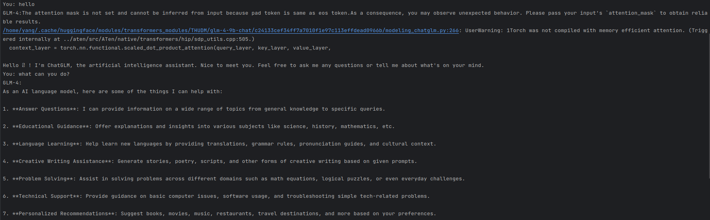
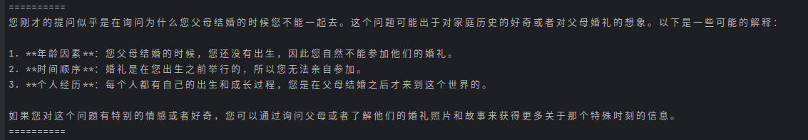
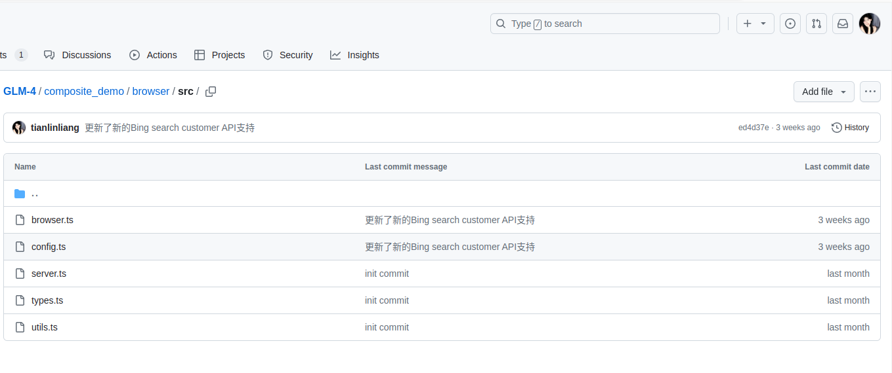
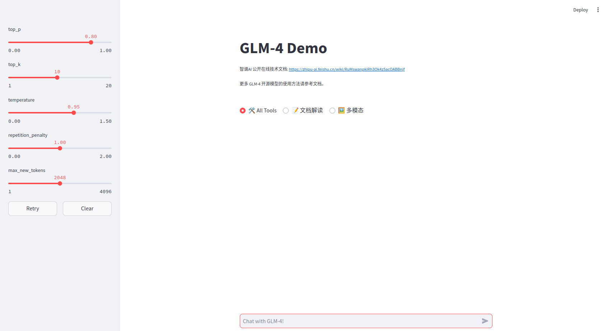
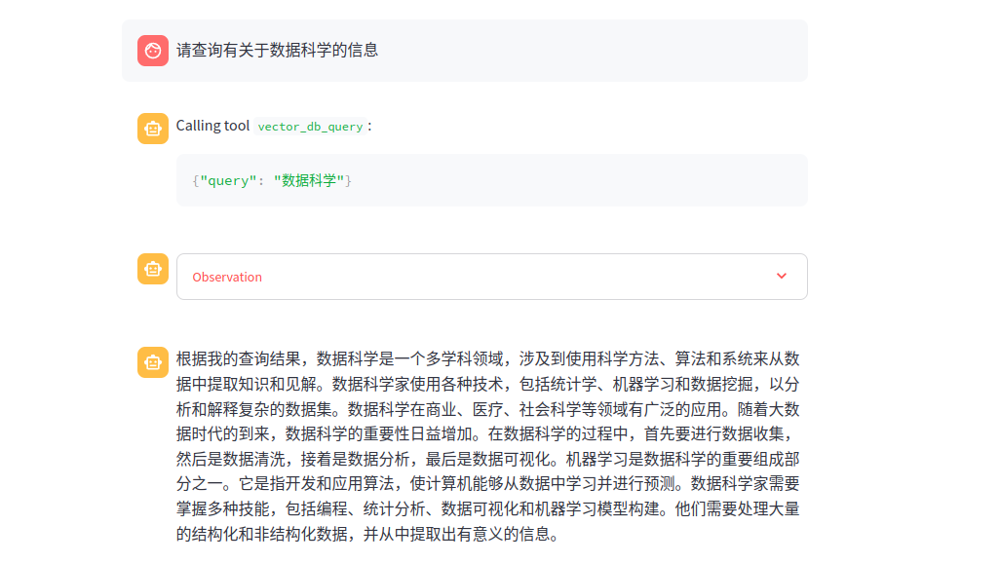
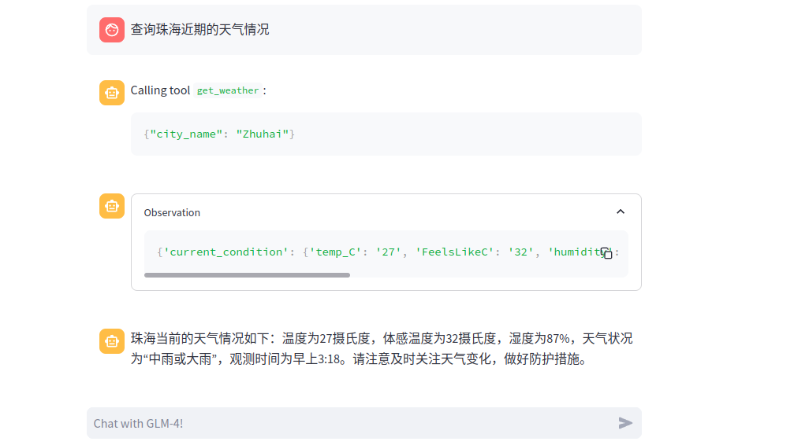
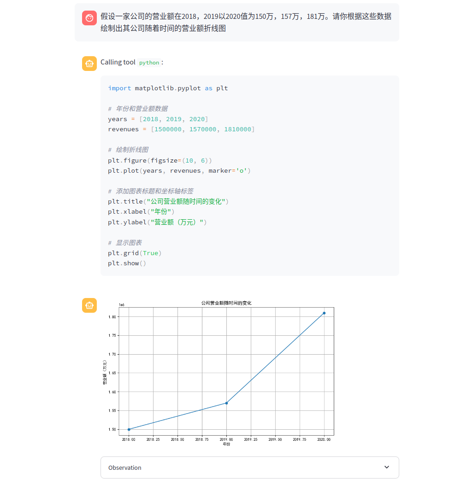
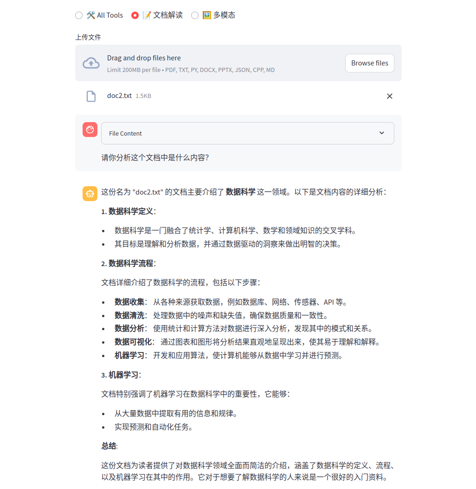

Read this in [English](README.md)
## 项目名称
  **基于GLM4开源项目实现向量数据库检索增强生成(RAG)**

## 项目前言
生成式 AI 现在是是人工智能领域中最激动人心且具有广泛前景的技术之一。它的应用范围包括艺术、娱乐、医疗和安全等多个领域，能够创造新的原创内容，如图片、文字、音乐或其他媒体作品。通过其独特的创造力和创新能力，生成式 AI 正在开创一个充满新可能性的世界。无论是LLM技术的蓬勃发展以或者是生成视频大模型Sora，无不展现出当今生成式应用在当今世界的强大流行。而开发者预训练大规模模型或者是部署模型都需要强大的GPU算力的支持。

如今AMD ROCm™ 开源 AI 开发软件平台为我们AMD AI开发者提供了一个非常良好的工作生产环境，强大ROCM开源计算平台可以支持在各种 AMD GPU 硬件上构建 AI 解决方案。ROCm 与多种行业标准框架（如 PyTorch 和 TensorFlow）无缝集成，并提供丰富的软件库，助力机器学习训练和推理。同时ROCm提供了丰富的工具和库，如MIOpen（用于深度学习的加速库）、rocBLAS（高性能线性代数库）和rocFFT（快速傅里叶变换库）等，帮助开发者简化开发过程并提升性能。

在这个类别中，我们开发者们够利用 ROCm 软件平台和AMD Radeon™ PRO W7900 超高性能显卡，设计出独特的LLM的应用解决方案，增强了LLM的信息检索能力，从而解决实际世界中的问题。


## 项目介绍

本项目使用高性能专业图形显卡AMD Radeon™ PRO W7900来进行部署以及调试。通过AMD Radeon™ PRO W7900强大的推理能力以及海量的48GB超大显存，助力我们项目开发者完成项目的部署、测试、调试以及编写LLM新的应用解决方案。项目的成功离不开AMD Radeon™ PRO W7900显卡强大的推理能力以及ROCM开源计算平台对于当今主流深度学习无缝集成多种行业标准框架。
我们的项目是基于Github开源项目THUDM/GLM-4所进行的项目开发、测试、调试

GLM-4-9B 是智谱 AI 推出的最新一代预训练模型 GLM-4 系列中的开源版本。 在语义、数学、推理、代码和知识等多方面的数据集测评中，
**GLM-4-9B** 及其人类偏好对齐的版本 **GLM-4-9B-Chat** 均表现出超越 Llama-3-8B 的卓越性能。除了能进行多轮对话，GLM-4-9B-Chat还支持长文本推理（支持最大 128K 上下文）的高级功能。本代模型增加了多语言支持，支持包括日语，韩语，德语在内的
26 种语言。原项目Github地址：https://github.com/THUDM/GLM-4/tree/main

**GLM4项目公布的相关推理测试数据并不是使用AMD的高性能显卡，其官方公布的测试硬件信息如下：**


+ OS: Ubuntu 22.04
+ Memory: 512GB
+ Python: 3.10.12 （推荐） / 3.12.3 均已测试
+ CUDA Version:  12.3
+ GPU Driver: 535.104.05
+ GPU: NVIDIA A100-SXM4-80GB * 8

显然GLM4项目并没有使用AMD的高性能显卡进行测试，包括在与项目开发者及维护者交谈中，项目维护者也对AMD的高性能图像显卡能够顺利运行其项目的LLM感到意外以及惊讶，因为他们并未为AMD显卡进行推理测试。


## 对开源社区的贡献

**我们通过使用AMD Radeon™ PRO W7900显卡顺利部署了该项目并且进行了一系列的测试，在测试项目后实现了对其大模型浏览器联网检索的改进并提交了PR给该仓库最终项目通过了我们工作小组所提交的代码。我们工作小组进一步利用该项目开发实现了LLM的向量数据库检索增强生成(RAG)的功能。我们的工作离不开使用高性能专业图形显卡AMD Radeon™ PRO W7900来进行部署以及调试，以及强大ROCM开源计算平台对于PyTorch 和 TensorFlow的完美适配支持！**

我们工作小组还对该项目的模型进行了一系列的测试，并成功在测试中发现了GLM4模型小概率出现的一个错误，该错误通常发生于模型在生成长文本内容的时候小概率发生，该错误会导致模型无法继续生成文字且会抛出下面所示的错误信息：

```error
Exception in thread Thread-11 (generate):
Traceback (most recent call last):
  File "/home/liang/miniconda3/envs/pytorch/lib/python3.10/threading.py", line 1009, in _bootstrap_inner
    self.run()
  File "/home/liang/miniconda3/envs/pytorch/lib/python3.10/threading.py", line 946, in run
    self._target(*self._args, **kwargs)
  File "/home/liang/miniconda3/envs/pytorch/lib/python3.10/site-packages/torch/utils/_contextlib.py", line 116, in decorate_context
    return func(*args, **kwargs)
  File "/home/liang/miniconda3/envs/pytorch/lib/python3.10/site-packages/transformers/generation/utils.py", line 1914, in generate
    result = self._sample()
  File "/home/liang/miniconda3/envs/pytorch/lib/python3.10/site-packages/transformers/generation/utils.py", line 2693, in _sample
    next_tokens = torch.multinomial(probs, num_samples=1).squeeze(1)
RuntimeError: probability tensor contains either inf, nan or element < 0
```

显然最后的错误信息指向了由于 torch.multinomial 函数在处理概率张量时，发现其中包含了无穷大 (inf)、非数 (nan) 或小于0的元素。这通常表明模型在生成过程中出现了数值不稳定性或输入数据异常。**所以我们立即报告给了GLM4项目的开发者以及维护者。在报告该问题后，开发者认可了我们测试所报告的问题并已经着手开始修复这个问题。**


## 项目的设备以及环境
+ OS: Ubuntu 22.04
+ Memory: 128GB
+ Python: 3.10.14 已测试
+ ROCM Version:  rocm6.0
+ GPU Driver: 24.10.3
+ GPU:  AMD Radeon™ PRO W7900* 1

## 项目调用流程
需要预先安装torch、torchaudio的2.3.1+rocm6.0版本以及torchaudio的0.18.1+rocm6.0版本
可以使用下面命令快速安装:

pip install torch==2.3.1 torchvision==0.18.1 torchaudio==2.3.1 --index-url https://download.pytorch.org/whl/rocm6.0

随后进入GLM4项目中，使用下面的命令安装依赖项目（建议新建一个虚拟环境，以下命令在虚拟环境下进行）：

```shell
cd GLM-4
cd basic_demo
pip install -r requirements.txt
```

**安装了这些依赖后就可以调用模型进行简单的对话了，可以使用命令行与 GLM-4-9B 模型进行对话:**

```shell
python trans_cli_demo.py # 调用GLM-4-9B-Chat实现连续对话

```

此时就可以初步体验到使用高性能专业图形显卡AMD Radeon™ PRO W7900部署本地LLM的魅力（此时为调用常规模型进行多伦对话）,示例为询问模型可以为我们做什么：



**使用 Batch 推理。**

```shell
python trans_batch_demo.py
```
代码中输入的batch_message为：

```python
    batch_message = [
        [
            {"role": "user", "content": "我的爸爸和妈妈结婚为什么不能带我去"},
            {"role": "assistant", "content": "因为他们结婚时你还没有出生"},
            {"role": "user", "content": "我刚才的提问是"}
        ],
        [
            {"role": "user", "content": "你好"}
        ]
    ]
```
输出结果：


我们还可以使用GLM-4-9B-Chat 网页浏览、代码执行、和长文本推理（支持最大 128K 上下文）等高级功能

要实现这些功能，首先我们需要对配置一些配置文件以及安装一些额外的依赖项目（在之前安装的虚拟环境中安装）：

```bash
cd composite_demo
pip install -r requirements.txt
```

请注意，本项目需要 Python 3.10 或更高版本。
此外，使用 Code Interpreter 还需要安装 Jupyter 内核：

```bash
ipython kernel install --name glm-4-demo --user
```

您可以修改 `~/.local/share/jupyter/kernels/glm-4-demo/kernel.json` 来改变 Jupyter 内核的配置，包括内核的启动参数等。例如，若您希望在使用 All Tools 的 Python 代码执行能力时使用 Matplotlib 画图，可以在 `argv` 数组中添加 `"--matplotlib=inline"`。

若要使用浏览器和搜索功能，还需要启动浏览器后端。首先，根据 [Node.js](https://nodejs.org/en/download/package-manager)
官网的指示安装 Node.js，然后安装包管理器 [PNPM](https://pnpm.io) 之后安装浏览器服务的依赖：

**值的注意的是，我们开发小组在浏览器搜索功能中实现了对新的Bing search customer API支持，改善了大模型调用浏览器工具的体验，更加方便使用。**

## 运行
```bash
cd browser
npm install -g pnpm
pnpm install
```
## 配置修改以及启动

1. 修改 `browser/src/config.ts` 中的 `BING_SEARCH_API_KEY` 配置浏览器服务需要使用的 Bing 搜索 API Key：

    ```diff
    export default {

        BROWSER_TIMEOUT: 10000,
        BING_SEARCH_API_URL: 'https://api.bing.microsoft.com/v7.0',
        BING_SEARCH_API_KEY: '<PUT_YOUR_BING_SEARCH_KEY_HERE>',

        HOST: 'localhost',
        PORT: 3000,
    };
    ```
   如果您注册的是Bing Customer Search的API，您可以修改您的配置文件为如下，并且填写您的Custom Configuration ID:

    ```diff
    export default {
        LOG_LEVEL: 'debug',
        BROWSER_TIMEOUT: 10000,
        BING_SEARCH_API_URL: 'https://api.bing.microsoft.com/v7.0/custom/',
        BING_SEARCH_API_KEY: 'YOUR_BING_SEARCH_API_KEY',
        CUSTOM_CONFIG_ID :  'YOUR_CUSTOM_CONFIG_ID', //将您的Custom Configuration ID放在此处
        HOST: 'localhost',
        PORT: 3000,
   };
    ```

2. 文生图功能需要调用 CogView API。修改 `src/tools/config.py`
   ，提供文生图功能需要使用的 [智谱 AI 开放平台](https://open.bigmodel.cn) API Key：

    ```diff
    BROWSER_SERVER_URL = 'http://localhost:3000'
    
    IPYKERNEL = 'glm-4-demo'
    
    ZHIPU_AI_KEY = '<PUT_YOUR_ZHIPU_AI_KEY_HERE>'
    COGVIEW_MODEL = 'cogview-3'
    ```

3. 启动浏览器后端，在单独的 shell 中：

    ```bash
    cd browser
    pnpm start
    ```

4. 在另外一个终端中运行以下命令在本地加载模型并启动 demo：

    ```bash
    streamlit run src/main.py
    ```

如果配置无误的话执行命令后会自动启动默认浏览器并打开对话网页(注意勾选All Tools选项)：
  
此时就可以使用网页端口对本地部署的LLM进行多伦对话了，可以使用GLM-4-9B-Chat 网页浏览、代码执行、和长文本推理（支持最大 128K 上下文）等高级功能

**值的注意的是，我们开发小组在此项目上额外实现了LLM的向量数据库检索增强生成(RAG)的功能，提高了生成文本的质量：通过引入检索机制，模型可以在生成过程中获取更相关和准确的信息。同时，LLM通过检索真实的数据和文档，可以减少模型的幻觉效应，提供更可靠的答案。扩展更多的知识范围：即使训练时的数据集有限，LLM通过访问外部知识库或文档，可以在生成时使用更广泛的信息，从而扩展模型的知识范围。增强了可解释性，我们设计向量数据库还实现了向量文本溯源的功能，提供了LLM回复内容的参考来源**

下面是创建向量数据库的代码，其作用为将文本内容向量化并且存入FAISS向量数据库中，提供给后续LLM进行调用向量数据库的内容进行查询调用，需要注意的是，放入的文本文件应该为和示例的doc1文档以及doc2文档一致，为一段无空行的文字内容。

```python
#/Base GLM-4 Demo for Vector Database Search/composite_demo/src/tools/Create  vector database.py
import os
import json
from langchain_nvidia_ai_endpoints import NVIDIAEmbeddings
from langchain.vectorstores import FAISS
from langchain.text_splitter import CharacterTextSplitter

# 设置 NVIDIA API 密钥
os.environ["NVIDIA_API_KEY"] = "put_your_nvidia_ai_api_here"

# 加载嵌入模型
embedder = NVIDIAEmbeddings(model="ai-embed-qa-4")

# 使用相对路径，文件应该为和示例的doc1文档以及doc2文档一致，为一段无空行的文字内容。
base_path = os.path.dirname(os.path.dirname(os.path.abspath(__file__)))
file_paths = [
    os.path.join(base_path,  "tools", "doc1.txt"),
    os.path.join(base_path,  "tools", "doc2.txt")
]

# 初始化文本分割器
text_splitter = CharacterTextSplitter(chunk_size=400, separator=" ")

# 初始化存储分割后的文本和元数据的列表
docs = []
metadatas = []

# 读取文件内容并进行分割
for file_path in file_paths:
    with open(file_path, 'r', encoding='utf-8') as file:
        content = file.read()
        splits = text_splitter.split_text(content)
        docs.extend(splits)
        metadatas.extend([{"source": file_path}] * len(splits))

# 打印分割后的文本块和元数据检查格式是否正确
for i, (doc, metadata) in enumerate(zip(docs, metadatas)):
    print(f"文本块 {i+1}:\n{doc}\n")
    print(f"元数据 {i+1}:\n{metadata}\n")

# 创建向量存储
store = FAISS.from_texts(docs, embedder, metadatas=metadatas)
store.save_local('./nv_embedding')

# 加载向量存储并进行查询
store = FAISS.load_local("./nv_embedding", embedder, allow_dangerous_deserialization=True)
retriever = store.as_retriever()

#测试向量数据库是否成功建立，可以根据自己的文本内容进行修改
query = "数据科学"
results = retriever.get_relevant_documents(query)

# 手动提取results中可序列化的部分
serializable_results = []
for result in results:
    serializable_results.append({
        'metadata': result.metadata,
        'page_content': result.page_content
    })

# 输出查询结果测试向量数据库是否成功建立
print(json.dumps(serializable_results, ensure_ascii=False, indent=2))

```
下面部分代码是在项目的工具类中编写向量数据库的查询函数，并且加载向量存储供给向量查询工具进行查询
```python
#/Base GLM-4 Demo for Vector Database Search/composite_demo/src/tools/tool_registry.py
from langchain_nvidia_ai_endpoints import NVIDIAEmbeddings
from langchain.vectorstores import FAISS
import os

# 设置 NVIDIA API 密钥
os.environ["NVIDIA_API_KEY"] = "put_your_nvidia_ai_api_here"

# 定义嵌入模型
embedder = NVIDIAEmbeddings(model="ai-embed-qa-4")

base_path = os.path.dirname(os.path.dirname(os.path.abspath(__file__)))
filepaths = os.path.join(base_path, "tools", "nv_embedding")
print(filepaths)
# 加载向量存储
store = FAISS.load_local(filepaths, embedder, allow_dangerous_deserialization=True)
retriever = store.as_retriever()

#......省略tool_registry中间部分代码

@register_tool
def vector_db_query(
        query: Annotated[str, "The query text to search in the vector database", True],
) -> str:
    """
    Queries the vector database using the given query text and returns the results in JSON format.
    """
    if not isinstance(query, str):
        raise TypeError("Query must be a string")

    # 进行查询
    results = retriever.get_relevant_documents(query)

    # 手动提取results中可序列化的部分
    serializable_results = []
    for result in results:
        serializable_results.append({
            'metadata': result.metadata,
            'page_content': result.page_content
        })

    # 返回查询结果
    return json.dumps(serializable_results, ensure_ascii=False, indent=2)

```

在运行了向量数据库生成代码后，我们就可以询问它我们存储在向量数据库中的信息，此时LLM就会利用向量数据库中的信息进行检索并且整合信息进行回复。我们通过RAG增强了模型的可解释性以及回答的准确性，同时减少了模型幻觉发生的可能。
  

然后我们还能继续询问它的回复来源于什么文档，做到了文本溯源的作用
  
可以调用联网工具向模型询问最近的新闻信息并且做总结，可以点击连接查看详细的新闻详情

  

还可以进行天气查询功能的实现：

 

同时可以在输入框中输入图像描述来让模型调用文生图能力进行生成图像

 
模型还具有调用python代码绘制图表的能力，可以生成出指定的折线图：

 

在网页中勾选文档解读后还可以上传PDF, TXT, PY, DOCX, PPTX, JSON, CPP, MD格式的文件让模型进行解读，此处上传了之前用于建立向量数据库的一个测试文档来让模型进行解读，显然模型读取并且正确理解了文档的内容：
 


## 协议

+ GLM-4 模型的权重的使用则需要遵循 [模型协议](https://huggingface.co/THUDM/glm-4-9b/blob/main/LICENSE)。

+ 本开源仓库的代码则遵循 [Apache 2.0](LICENSE) 协议。

请您严格遵循开源协议。

## 引用


```
@misc{glm2024chatglm,
      title={ChatGLM: A Family of Large Language Models from GLM-130B to GLM-4 All Tools}, 
      author={Team GLM and Aohan Zeng and Bin Xu and Bowen Wang and Chenhui Zhang and Da Yin and Diego Rojas and Guanyu Feng and Hanlin Zhao and Hanyu Lai and Hao Yu and Hongning Wang and Jiadai Sun and Jiajie Zhang and Jiale Cheng and Jiayi Gui and Jie Tang and Jing Zhang and Juanzi Li and Lei Zhao and Lindong Wu and Lucen Zhong and Mingdao Liu and Minlie Huang and Peng Zhang and Qinkai Zheng and Rui Lu and Shuaiqi Duan and Shudan Zhang and Shulin Cao and Shuxun Yang and Weng Lam Tam and Wenyi Zhao and Xiao Liu and Xiao Xia and Xiaohan Zhang and Xiaotao Gu and Xin Lv and Xinghan Liu and Xinyi Liu and Xinyue Yang and Xixuan Song and Xunkai Zhang and Yifan An and Yifan Xu and Yilin Niu and Yuantao Yang and Yueyan Li and Yushi Bai and Yuxiao Dong and Zehan Qi and Zhaoyu Wang and Zhen Yang and Zhengxiao Du and Zhenyu Hou and Zihan Wang},
      year={2024},
      eprint={2406.12793},
      archivePrefix={arXiv},
      primaryClass={id='cs.CL' full_name='Computation and Language' is_active=True alt_name='cmp-lg' in_archive='cs' is_general=False description='Covers natural language processing. Roughly includes material in ACM Subject Class I.2.7. Note that work on artificial languages (programming languages, logics, formal systems) that does not explicitly address natural-language issues broadly construed (natural-language processing, computational linguistics, speech, text retrieval, etc.) is not appropriate for this area.'}
}
```

```
@misc{wang2023cogvlm,
      title={CogVLM: Visual Expert for Pretrained Language Models}, 
      author={Weihan Wang and Qingsong Lv and Wenmeng Yu and Wenyi Hong and Ji Qi and Yan Wang and Junhui Ji and Zhuoyi Yang and Lei Zhao and Xixuan Song and Jiazheng Xu and Bin Xu and Juanzi Li and Yuxiao Dong and Ming Ding and Jie Tang},
      year={2023},
      eprint={2311.03079},
      archivePrefix={arXiv},
      primaryClass={cs.CV}
}
```
